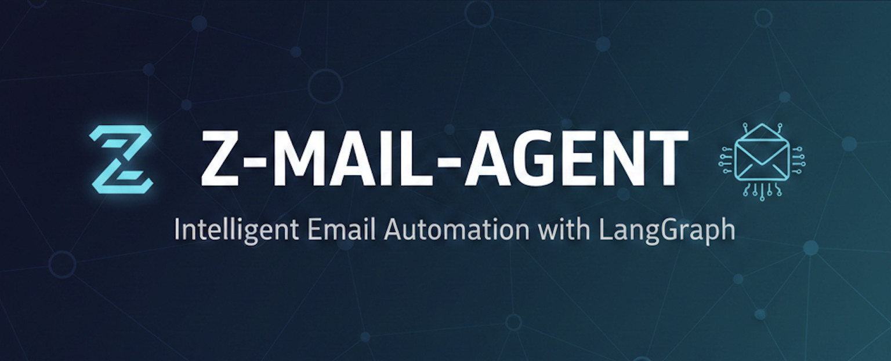
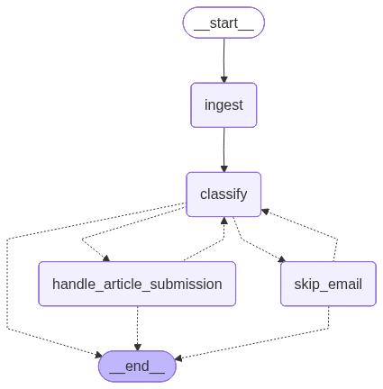

# z-mail-agent



An extensible, configuration-driven email automation framework built with LangGraph and LLMs. Automatically classify and respond to emails using custom classification rules and templates - no code changes required.

> **Note:** This is the public framework repository with example configurations. For production use, create a private fork to store your actual prompts and templates. See [Setting Up Your Private Instance](#setting-up-your-private-instance) below.

## Overview

z-mail-agent is a **generic and extensible** email automation framework that:
- Fetches unread emails from your inbox
- Classifies them using GPT-4o with **custom, user-defined prompts**
- Sends automated responses based on **configurable templates**
- Labels processed emails to avoid duplicate processing
- Supports **unlimited email classifications** via simple YAML configuration
- Provides detailed logging and error handling

**Add new email types without touching code** - just edit configuration files!

## Architecture



The codebase is organized into modular components for easy maintenance and extensibility:

```
z-mail-agent/
├── main.py                     # Entry point with LangGraph workflow
├── config.py                   # Runtime configuration (env vars, logging)
├── classifications.yaml        # Email classification definitions (THE BRAIN)
├── models.py                   # Type definitions (Pydantic models, AgentState)
├── prompts/                    # Classification prompts (one per type)
│   └── article_submission.txt
├── templates/                  # Reply templates (one per classification)
│   └── article_submission_reply.txt
├── email_providers/            # Email provider implementations
│   ├── __init__.py
│   ├── base.py                # Abstract EmailProvider interface
│   └── zoho.py                # Zoho Mail implementation
└── nodes/                      # LangGraph workflow nodes
    ├── __init__.py
    ├── ingest.py              # Email ingestion node
    ├── classify.py            # Email classification with LLM
    └── handlers.py            # Action handlers (reply, skip)
```

### Key Components

#### Configuration-Driven Classification

Define email classifications in [classifications.yaml](classifications.yaml):

```yaml
classifications:
  - name: article_submission
    priority: 1
    description: "Requests to submit articles or guest posts"
    classification_prompt: prompts/article_submission.txt
    action: reply
    reply_template: templates/article_submission_reply.txt
```

Each classification specifies:
- **name**: Unique identifier
- **priority**: Processing order (lower = checked first)
- **description**: Human-readable description
- **classification_prompt**: Path to custom prompt file
- **action**: What to do (reply, skip, forward, label)
- **reply_template**: Path to reply template (if action=reply)

Classifications are checked in priority order using a **waterfall approach** - the first match wins. Unmatched emails are automatically skipped.

#### Email Provider Interface

The `EmailProvider` abstract base class in [email_providers/base.py](email_providers/base.py) defines a standard interface for email operations:

```python
class EmailProvider(ABC):
    @abstractmethod
    def fetch_unread_emails(self, limit: int, exclude_label_id: Optional[str] = None) -> List[Dict]:
        """Fetch unread emails, optionally excluding those with a specific label."""
        
    @abstractmethod
    def get_email_content(self, message_id: str, folder_id: str) -> str:
        """Retrieve the full content of an email."""
        
    @abstractmethod
    def send_reply(self, message_id: str, to_address: str, subject: str, content: str) -> bool:
        """Send a reply email."""
        
    @abstractmethod
    def mark_as_read(self, message_id: str) -> bool:
        """Mark an email as read."""
        
    @abstractmethod
    def apply_label(self, message_id: str, folder_id: str, label_id: str) -> bool:
        """Apply a label to an email."""
```

This design allows you to easily add support for other email providers (Gmail, Outlook, etc.) by implementing these 5 methods.

#### LangGraph Workflow

The workflow follows this sequence:

1. **Ingest** - Fetch unread emails (excluding already processed ones)
2. **Classify** - Use LLM with custom prompts to classify emails (waterfall approach)
3. **Handle** - Execute action based on classification (reply, skip, etc.)
4. **Loop** - Process next email or end workflow

Each node is created using factory functions that accept an `EmailProvider` instance, enabling dependency injection and testability.

## Quick Start

### For Testing/Development

1. Clone the repository:
```bash
git clone https://github.com/yourusername/z-mail-agent.git
cd z-mail-agent
```

2. Install dependencies:
```bash
pip install -r requirements.txt
```

3. Set up environment variables:
```bash
cp .env.example .env
# Edit .env with your configuration
```

4. Copy and customize example prompts:
```bash
cp prompts/article_submission.example.txt prompts/article_submission.txt
cp templates/article_submission_reply.example.txt templates/article_submission_reply.txt
```

5. Run locally:
```bash
python main.py
```

### Setting Up Your Private Instance

For production use with proprietary prompts and automated scheduling:

1. **Create a private mirror** (not a fork):
```bash
# Clone as bare repository
git clone --bare https://github.com/yourusername/z-mail-agent.git

# Mirror to your new private repo (create it on GitHub first!)
cd z-mail-agent.git
git push --mirror https://github.com/yourusername/z-mail-agent-private.git

# Clean up
cd .. && rm -rf z-mail-agent.git

# Clone your private repo
git clone https://github.com/yourusername/z-mail-agent-private.git
cd z-mail-agent-private
```

2. **Commit your actual prompts and templates**:
```bash
# Remove gitignore rules for prompts/templates
sed -i '' '/# Proprietary content/,/!templates\/\*.example.txt/d' .gitignore

# Add your actual prompts and templates
git add prompts/*.txt templates/*.txt .gitignore
git commit -m "Add production prompts and templates"
git push
```

3. **Set up GitHub Actions cron**:
   - Go to **Settings → Secrets and variables → Actions**
   - Add required secrets (API keys, account IDs, etc.)
   - Enable Actions - workflow runs automatically every 15 minutes

See [DEPLOYMENT.md](DEPLOYMENT.md) for detailed deployment instructions.

## Configuration

Configure the assistant using environment variables in your `.env` file:

```bash
# LLM Configuration (for email classification)
LLM_PROVIDER=openai              # Provider: openai, anthropic
LLM_MODEL=gpt-4o                 # Model name (e.g., gpt-4o, gpt-4-turbo, claude-3-5-sonnet-20241022)
LLM_TEMPERATURE=0                # Temperature 0-1 (0=deterministic, 1=creative)
LLM_API_KEY=your_api_key         # API key for the LLM provider

# Legacy: OPENAI_API_KEY still supported for backwards compatibility
# OPENAI_API_KEY=your_openai_api_key

# Zoho Mail Configuration
ZOHO_MCP_URL=http://localhost:3000
ZOHO_ACCOUNT_ID=your_account_id
REPLY_EMAIL_ADDRESS=your_email@domain.com

# Behavior flags
DEBUG=false           # Enable debug logging
DRY_RUN=false        # Log actions without executing
SEND_REPLY=true      # Send email replies
ADD_LABEL=true       # Apply labels to processed emails
```

### Configuration Flags

**LLM Settings:**
- **LLM_PROVIDER**: AI provider to use (`openai`, `anthropic`)
- **LLM_MODEL**: Model name (e.g., `gpt-4o`, `gpt-4-turbo`, `claude-3-5-sonnet-20241022`)
- **LLM_TEMPERATURE**: Creativity level 0-1 (0=deterministic, recommended for classification)
- **LLM_API_KEY**: API key for your chosen provider

**Behavior Flags:**
- **DEBUG**: When `true`, logs detailed API request/response information
- **DRY_RUN**: When `true`, simulates actions without actually sending emails or modifying data
- **SEND_REPLY**: Controls whether to send automated replies (only relevant when `DRY_RUN=false`)
- **ADD_LABEL**: Controls whether to apply labels to processed emails

## Configuring Email Classifications

Add new email types by editing [classifications.yaml](classifications.yaml):

### 1. Add Classification Entry

```yaml
classifications:
  - name: support_request
    priority: 2
    description: "Customer support inquiries"
    classification_prompt: prompts/support_request.txt
    action: reply
    reply_template: templates/support_reply.txt
```

### 2. Create Classification Prompt

Create `prompts/support_request.txt`:
```
Is this email a customer support request?

CLASSIFY AS TRUE (match) if:
- Requesting help or assistance
- Reporting an issue or problem
- Keywords: 'help', 'support', 'issue', 'problem', 'not working'

CLASSIFY AS FALSE (no match) if:
- General inquiries
- Sales questions

Return JSON: {"match": true/false, "confidence": 0.95, "reasoning": "..."}
```

### 3. Create Reply Template

Create `templates/support_reply.txt`:
```
Thank you for contacting support.

We've received your request and will respond within 24 hours.

Best regards,
Support Team
```

### 4. Done!

No code changes needed - the framework automatically loads and uses your new classification.

## Usage

Run the assistant:

```bash
python main.py
```

The assistant will:
1. Fetch unread emails from your inbox
2. Filter out already-processed emails (those with the "processed by z-mail-agent" label)
3. Classify each email using your custom prompts (in priority order)
4. Send automated responses to genuine requests
5. Apply labels to all processed emails
6. Display a summary of actions taken

## Adding New Email Providers

To add support for a new email provider (e.g., Gmail):

1. Create a new file in the `email_providers/` directory (e.g., `gmail.py`)
2. Implement the `EmailProvider` interface:

```python
from email_providers.base import EmailProvider
from typing import List, Dict, Optional

class GmailEmailProvider(EmailProvider):
    def __init__(self):
        # Initialize Gmail API client
        pass
    
    def fetch_unread_emails(self, limit: int, exclude_label_id: Optional[str] = None) -> List[Dict]:
        # Implement using Gmail API
        pass
    
    def get_email_content(self, message_id: str, folder_id: str) -> str:
        # Implement using Gmail API
        pass
    
    def send_reply(self, message_id: str, to_address: str, subject: str, content: str) -> bool:
        # Implement using Gmail API
        pass
    
    def mark_as_read(self, message_id: str) -> bool:
        # Implement using Gmail API
        pass
    
    def apply_label(self, message_id: str, folder_id: str, label_id: str) -> bool:
        # Implement using Gmail API
        pass
```

3. Update `email_providers/__init__.py` to export your new provider:
```python
from email_providers.gmail import GmailEmailProvider
```

4. Update `main.py` to use your provider:
```python
# Replace ZohoEmailProvider with your provider
email_provider = GmailEmailProvider()
```

## Development

### Project Structure

- **config.py**: Centralized configuration using Pydantic models
- **models.py**: Type definitions for LangGraph state and LLM output
- **email_providers/base.py**: Abstract interface for email operations
- **email_providers/zoho.py**: Zoho Mail implementation via MCP
- **nodes/**: LangGraph workflow nodes with factory functions
- **main.py**: Workflow construction and execution

### Testing

#### Unit Tests

The project includes comprehensive unit tests covering:
- Configuration loading and validation
- Email provider implementations
- Workflow nodes and routing logic
- State management

Run the test suite:

```bash
# Run all tests
pytest

# Run with coverage report
pytest --cov=. --cov-report=html

# Run specific test file
pytest tests/test_config.py -v

# Run tests matching pattern
pytest -k "test_email" -v
```

View coverage report:
```bash
open htmlcov/index.html  # macOS
xdg-open htmlcov/index.html  # Linux
```

#### Manual Testing

Run in dry-run mode to test without sending emails:

```bash
DEBUG=true DRY_RUN=true python main.py
```

Test with labeling only (no replies):

```bash
SEND_REPLY=false ADD_LABEL=true python main.py
```

## Deployment

### Free Option: GitHub Actions (Recommended)

Run your agent automatically using GitHub Actions cron (completely free):

1. **Create a private mirror** of this repo (see [Setting Up Your Private Instance](#setting-up-your-private-instance))
2. **Add your actual prompts/templates** and commit them
3. **Add GitHub Secrets** (Settings → Secrets → Actions):
   - `ZOHO_ACCOUNT_ID`
   - `ZOHO_PROCESSED_LABEL_ID`
   - `ZOHO_MCP_URL`
   - `OPENAI_API_KEY`
   - `REPLY_EMAIL_ADDRESS`
4. **Enable GitHub Actions** - workflow runs every 15 minutes automatically

The workflow file (`.github/workflows/email-cron.yml`) is already configured!

### Paid Option: LangGraph Cloud

Deploy z-mail-agent to LangGraph Cloud with scheduled cron jobs for automated email processing. See [DEPLOYMENT.md](DEPLOYMENT.md) for detailed instructions on:

- Deploying to LangGraph Cloud via GitHub integration
- Setting up cron scheduling (every 15 mins, hourly, etc.)
- Managing environment variables securely
- Monitoring with LangSmith traces
- Production best practices

Quick deploy:
```bash
# Push to GitHub
git push origin main

# Then deploy via LangSmith UI:
# https://smith.langchain.com → Deployments → + New Deployment
```

## Contributing

Contributions are welcome! Areas for improvement:

1. **Email Providers**: Implement support for Gmail, Outlook, etc.
2. **Classification**: Enhance LLM prompts for better accuracy
3. **Handlers**: Add new email categories and automated responses
4. **Testing**: Expand test coverage and add integration tests
5. **Documentation**: Improve setup guides and examples

When contributing, please:
- Add unit tests for new features
- Ensure all tests pass (`pytest`)
- Follow existing code style
- Update documentation as needed

## License

MIT License - see [LICENSE](LICENSE) file for details.

## Support

For issues and questions, please open an issue on GitHub.
